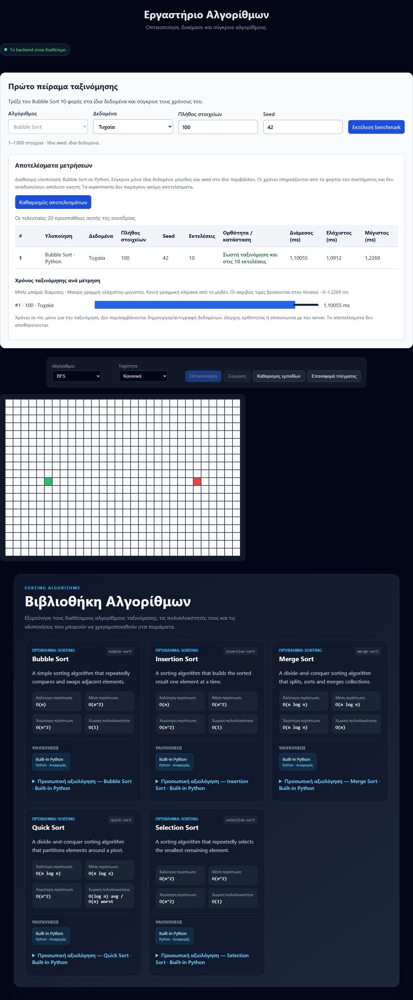

# Algorithm Evaluation Lab

**Εργαστήριο Αξιολόγησης Αλγορίθμων** — εκπαιδευτική full-stack εφαρμογή για να συνδέουμε τη θεωρητική πολυπλοκότητα των αλγορίθμων με πραγματικές μετρήσεις.

Το project εξελίχθηκε από ένα pathfinding visualizer σε εργαστήριο για testing, benchmarking, visualization, comparison και προσωπική αξιολόγηση algorithm implementations. Το GitHub repository διατηρεί το όνομα `Pathfinding-Algorithm-Lab`.

Σήμερα μπορείς να εξερευνήσεις sorting algorithms, να τρέξεις Bubble Sort σε ελεγχόμενα datasets και να εξετάσεις ορθότητα και χρόνους εκτέλεσης. Το UI είναι προεπιλεγμένα στα Ελληνικά· το header χρησιμοποιεί τη συντομότερη ονομασία «Εργαστήριο Αλγορίθμων».

[Τοπική εγκατάσταση](#quick-start) · [Αρχιτεκτονική](#architecture) · [Roadmap](docs/ROADMAP.md) · [API](docs/API.md)

## Τι λειτουργεί σήμερα

| Περιοχή | Υλοποιημένη δυνατότητα |
| --- | --- |
| Algorithm Library | Bubble, Selection, Insertion, Merge και Quick Sort με Big-O metadata και built-in implementation records. Εκτελέσιμος στο benchmark είναι προς το παρόν μόνο ο Bubble Sort. |
| Dataset generators | Random, Sorted, Reversed και Nearly Sorted, με size/seed και επαναλήψιμη παραγωγή εισόδου. |
| Benchmark | 10 εκτελέσεις Bubble Sort σε ανεξάρτητα αντίγραφα του ίδιου dataset, με correctness check και median/min/max. Μέγεθος 1–1.000 στοιχεία. |
| Results dashboard | Πίνακας και chart για τις τελευταίες 20 προσπάθειες της τρέχουσας συνεδρίας, μαζί με error/timeout states. |
| Experiment API | Δημιουργία και ανάκτηση αποθηκευμένων draft definitions: implementations και dataset configurations. Δεν εκτελεί ακόμη experiments. |
| Implementation reviews | Προσωπικές βαθμολογίες και σημειώσεις ανά implementation, με αποθήκευση και επεξεργασία. |
| Custom Python validation | Ελληνική φόρμα για syntax/solve(values)/size checks χωρίς εκτέλεση. Ρητή τοπική CLI εκτέλεση δικού μας κώδικα με timeout 2 δευτερολέπτων. |
| Pathfinding foundation | Grid, walls και clear/reset controls. Τα algorithm execution/animation controls παραμένουν ανενεργά. |

Τα #17–#21 έχουν ενσωματωθεί μέσω των PR #28–#32 και προωθηθεί στη main με το PR #33. Το [#22 — custom Python validation](https://github.com/ChristosGiann/Pathfinding-Algorithm-Lab/pull/38) έχει ενσωματωθεί στο dev μέσω του PR #38. Η main παραμένει στο προηγούμενο snapshot μέχρι την επόμενη ρητά εγκεκριμένη προώθηση.

## Benchmarking και visualization

**Benchmarking** σημαίνει ότι μετράμε την εκτέλεση του αλγορίθμου πάνω σε συγκεκριμένη είσοδο. **Visualization** σημαίνει ότι παρουσιάζουμε τα βήματά του για να καταλάβουμε πώς λειτουργεί. Το animation μπορεί να έχει τεχνητές καθυστερήσεις και δεν πρέπει να χρησιμοποιείται ως χρόνος του αλγορίθμου.

Στον υπάρχοντα runner μετριέται μόνο η ταξινόμηση, με `perf_counter_ns()`. Dataset generation, αντιγραφή εισόδου, correctness checks, HTTP επικοινωνία και React rendering είναι εκτός του timed region. Το ίδιο seed αναπαράγει τα δεδομένα, όχι τον ίδιο χρόνο: το hardware και το φορτίο του συστήματος επηρεάζουν τις μετρήσεις.

## Screenshots και demo

Πραγματικό screenshot από το local app στις 2026-09-25: Bubble Sort με Random dataset, size 100, seed 42, αποτέλεσμα 10 εκτελέσεων και Algorithm Library. Το screenshot προέρχεται από το snapshot πριν από το #22 και δεν δείχνει τη νέα φόρμα validation. Οι τιμές είναι ενδεικτικές μιας εκτέλεσης και δεν αποτελούν performance εγγύηση.

<details>
<summary>Προβολή εφαρμογής: benchmark, results dashboard και Algorithm Library</summary>



</details>

**Live demo:** δεν υπάρχει ακόμη δημοσιευμένο demo URL. Για δοκιμή ακολούθησε το local setup. Ο σύνδεσμος θα προστεθεί όταν γίνει deploy.

## Tech stack

| Layer | Τεχνολογίες |
| --- | --- |
| Frontend | React 19, TypeScript 6, Vite 8, CSS, Fetch API |
| Backend | Python, Django 5.2, Django REST Framework 3.17 |
| Development database | SQLite |
| Quality | Django tests, Node test runner, ESLint, TypeScript build |
| Workflow | GitHub Issues, issue branches, Pull Requests προς dev |

Οι ακριβείς dependency versions βρίσκονται στα `package-lock.json` και `backend/requirements.txt`.

<a id="quick-start"></a>
## Quick start

Απαιτούνται Git, Python 3.10+ και Node.js 22.15+ με npm. Το παράδειγμα χρησιμοποιεί Windows PowerShell και δύο terminals. Οι παρακάτω εντολές εκτελούνται από το repository root.

```powershell
git clone https://github.com/ChristosGiann/Pathfinding-Algorithm-Lab.git
cd Pathfinding-Algorithm-Lab
git switch dev
```

### Backend — πρώτο terminal

Δημιούργησε το virtual environment και εγκατάστησε τις dependencies:

```powershell
python -m venv backend\.venv
.\backend\.venv\Scripts\python.exe -m pip install -r backend\requirements.txt
if (-not (Test-Path backend\.env)) { Copy-Item backend\.env.example backend\.env }
```

Στο `backend/.env`, αντικατάστησε το placeholder `DJANGO_SECRET_KEY` με δικό σου τυχαίο local secret και κράτησε `DJANGO_DEBUG=True` για development. Μπορείς να δημιουργήσεις μια τιμή με:

```powershell
.\backend\.venv\Scripts\python.exe -c "from django.core.management.utils import get_random_secret_key; print(get_random_secret_key())"
```

Αποθήκευσε την τιμή στο `.env`, όχι στο Git. Στη συνέχεια:

```powershell
.\backend\.venv\Scripts\python.exe backend\manage.py migrate
.\backend\.venv\Scripts\python.exe backend\manage.py seed_sorting_algorithms
.\backend\.venv\Scripts\python.exe backend\manage.py runserver 127.0.0.1:8000
```

Το seed command είναι idempotent: μπορεί να ξανατρέξει χωρίς διπλές εγγραφές. Το health endpoint είναι [GET /api/health/](http://127.0.0.1:8000/api/health/) και επιστρέφει `{"status":"ok"}`. Οι εντολές χρησιμοποιούν απευθείας τον interpreter, επομένως δεν απαιτείται activation ή αλλαγή PowerShell execution policy.

### Frontend — δεύτερο terminal

```powershell
npm ci
if (-not (Test-Path .env.local)) { Copy-Item .env.example .env.local }
npm run dev -- --host 127.0.0.1
```

Το `.env.local` πρέπει να περιέχει:

```dotenv
VITE_API_BASE_URL=http://127.0.0.1:8000
```

Άνοιξε το [local frontend](http://127.0.0.1:5173/). Αν αλλάξεις το `.env.local`, κάνε restart τον Vite server. Τα υπάρχοντα environment files διατηρούνται από τις παραπάνω εντολές.

Σε macOS/Linux χρησιμοποίησε `python3` για τη δημιουργία του venv και `backend/.venv/bin/python` αντί για το Windows interpreter path. Για την πρώτη αντιγραφή των env examples χρησιμοποίησε το αντίστοιχο `cp`, μόνο εφόσον δεν υπάρχουν ήδη τα αρχεία.

### Πρώτη δοκιμή

1. Επιβεβαίωσε ότι η ένδειξη γράφει «Το backend είναι διαθέσιμο» και εμφανίζονται πέντε algorithm cards.
2. Στη φόρμα «Πρώτο πείραμα ταξινόμησης» κράτησε Random, size 100 και seed 42.
3. Πάτησε «Εκτέλεση benchmark». Στον πίνακα εμφανίζονται 10 runs, correctness και median/min/max σε milliseconds.
4. Επανάλαβε με τα ίδια δεδομένα για να δεις τη διακύμανση. Με refresh καθαρίζεται το session history.

Αν η Library είναι κενή, έλεγξε ότι έτρεξες το seed command. Αν ο backend δεν είναι διαθέσιμος, έλεγξε το πρώτο terminal και το `VITE_API_BASE_URL`. Για περισσότερες εντολές δες το [Development guide](docs/DEVELOPMENT.md).

<a id="architecture"></a>
## Αρχιτεκτονική και πρώτο vertical slice

```text
React benchmark form
        ↓ POST /api/benchmarks/bubble-sort/
Django / DRF request validation
        ↓
Dataset generator → fresh copy για κάθε run
        ↓
Trusted Python Bubble Sort × 10
        ↓
Correctness checks + timing statistics
        ↓ JSON response
React Result Card / Results Dashboard
```

Το πρώτο vertical slice συνδέει **React → Django → Bubble Sort benchmark → Result Card**, που πλέον έχει εξελιχθεί σε πίνακα και chart αποτελεσμάτων. Ο centralized API client βρίσκεται στο `src/services/apiClient.ts`. Ο runner και οι dataset generators βρίσκονται στα `backend/core/benchmarks/` και `backend/core/datasets/`.

Τα experiment definitions και τα implementation reviews αποθηκεύονται μέσω Django models. Ο benchmark runner παραμένει ξεχωριστός και δεν αποθηκεύει timing results. Αυτό αποφεύγει να εμφανίζεται η αποθήκευση μιας ρύθμισης ως ολοκληρωμένη εκτέλεση.

```text
src/                   React components, i18n, API client, types
backend/core/          Algorithm catalogue, datasets, benchmarks, experiments
backend/reviews/       Implementation ratings και notes
backend/config/        Django settings και routing
tests/                 Frontend rendering regression tests
docs/                  Architecture, API, decisions και workflow
```

## Tests και checks

Από το repository root:

```powershell
npm test
npm run lint
npm run build
.\backend\.venv\Scripts\python.exe backend\manage.py check
.\backend\.venv\Scripts\python.exe backend\manage.py test core reviews
.\backend\.venv\Scripts\python.exe backend\manage.py makemigrations --check --dry-run
git diff --check
```

Το integrated snapshot έχει 60 backend tests και 4 frontend rendering tests. Η κάλυψη περιλαμβάνει dataset reproducibility, ανεξάρτητα input copies, benchmark correctness/timing boundaries, API validation, experiment persistence και reviews. Τα frontend tests δεν αποτελούν πλήρες end-to-end suite. Αναλυτικά στο [Testing guide](docs/TESTING.md).

## Περιορισμοί MVP

- Μόνο Bubble Sort εκτελείται. Τα υπόλοιπα seeded algorithms είναι catalogue metadata.
- Τα experiments αποθηκεύουν definitions, όχι execution lifecycle ή μετρήσεις. Δεν υπάρχει persistent benchmark history ή σύγκριση πολλών implementations.
- Το benchmark είναι synchronous, με 10 runs και όριο 1.000 στοιχείων, χωρίς warm-up exclusion ή απομονωμένο performance environment.
- Τα reviews είναι κοινά ανά implementation στο single-user local MVP, χωρίς account isolation.
- Το pathfinding grid είναι foundation· BFS/DFS execution και animation παραμένουν μελλοντικά.
- Υπάρχει i18n δομή, αλλά όχι ακόμη language selector (#11).
- **Custom code execution δεν είναι public-safe χωρίς πραγματικό sandbox**, όπως κατάλληλα περιορισμένο Docker environment. Ένα subprocess και ένα timeout δεν αποτελούν sandbox. Το PR #38 προσθέτει static validation και ρητή developer-only CLI εκτέλεση, όχι ασφαλή δημόσια εκτέλεση.
- Το local setup δεν αποτελεί production deployment configuration.

## Roadmap

| Κατάσταση | Επόμενα βήματα |
| --- | --- |
| Υλοποιημένα | Algorithm Library, datasets, Bubble Sort benchmark, draft experiments, results dashboard και reviews (#16–#21). |
| Υλοποιημένο στο dev | Custom Python validation (#22 / PR #38). |
| Τρέχουσα τεκμηρίωση | Portfolio-ready README (#12 / PR #39), με πραγματικό screenshot, setup και scope. |
| Επόμενη λειτουργική επέκταση | Language selector (#11) και σχεδιασμός της πλήρους MVP integration: πολλαπλές εκτελέσιμες implementations, αποθήκευση αποτελεσμάτων και comparison. |
| Μελλοντικά | Sorting visualization, searching, graph/pathfinding και άλλες algorithm families. |

Το [Roadmap](docs/ROADMAP.md) καταγράφει τις φάσεις και το [Progress](docs/PROGRESS.md) το τρέχον snapshot. Οι μελλοντικοί στόχοι δεν παρουσιάζονται ως έτοιμες λειτουργίες.

## Development workflow

`ενημερωμένο dev → issue branch → code/tests/docs → PR προς dev → review/merge → διαγραφή προσωρινού branch`

Τα `main` και `dev` είναι μόνιμα. **Δεν διαγράφουμε ποτέ το dev**, τοπικά ή στο GitHub. Η main ενημερώνεται από το dev μόνο με ρητή εντολή και ακολουθεί συγχρονισμός της main πίσω στο dev πριν από το επόμενο issue.

Η τεκμηρίωση αλλάζει στο ίδιο branch και PR με τη λειτουργικότητα. Έτσι μεταφέρεται μαζί με τον κώδικα στο dev και αργότερα στη main. Οι PR περιγραφές και τα GitHub σχόλια γράφονται στα Ελληνικά, με τους τεχνικούς όρους στα Αγγλικά. Πριν κλείσει ολοκληρωμένο issue, προστίθεται σχόλιο με αιτιολόγηση και σύνδεσμο στο merged PR.

## Τεκμηρίωση

- [Project definition](docs/PROJECT.md) · [Architecture](docs/ARCHITECTURE.md)
- [Roadmap](docs/ROADMAP.md) · [Progress](docs/PROGRESS.md)
- [Development](docs/DEVELOPMENT.md) · [Decisions](docs/DECISIONS.md)
- [API](docs/API.md) · [Testing](docs/TESTING.md)
- [Datasets](docs/DATASETS.md) · [Benchmarks](docs/BENCHMARKS.md)
- [Experiments](docs/EXPERIMENTS.md) · [Results dashboard](docs/RESULTS_DASHBOARD.md)
- [Implementation reviews](docs/IMPLEMENTATION_REVIEWS.md)

- [Custom Python validation και τοπική εκτέλεση](docs/CUSTOM_PYTHON.md)
