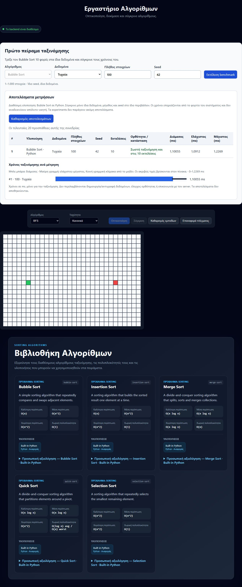

# Algorithm Evaluation Lab

**Εργαστήριο Αξιολόγησης Αλγορίθμων** — εκπαιδευτική full-stack εφαρμογή για να συνδέουμε τη θεωρητική πολυπλοκότητα των αλγορίθμων με πραγματικές μετρήσεις.

Το project εξελίχθηκε από ένα pathfinding visualizer σε εργαστήριο για testing, benchmarking, visualization, comparison και προσωπική αξιολόγηση algorithm implementations. Το GitHub repository διατηρεί το όνομα `Pathfinding-Algorithm-Lab`.

Σήμερα μπορείς να εξερευνήσεις εκπαιδευτικό el/en sorting catalogue, να δεις step visualization, να συγκρίνεις 2–5 algorithms στα ίδια δεδομένα, να αποθηκεύσεις και να ξανανοίξεις comparisons, να τρέξεις Bubble Sort, Insertion Sort, Selection Sort, Merge Sort ή Quick Sort σε ελεγχόμενα datasets και να εξετάσεις ορθότητα και χρόνους εκτέλεσης. Το UI είναι προεπιλεγμένα στα Ελληνικά· το header χρησιμοποιεί τη συντομότερη ονομασία «Εργαστήριο Αλγορίθμων».

[Τοπική εγκατάσταση](#quick-start) · [Αρχιτεκτονική](#architecture) · [Roadmap](docs/ROADMAP.md) · [API](docs/API.md)

## Τι λειτουργεί σήμερα

| Περιοχή | Υλοποιημένη δυνατότητα |
| --- | --- |
| Algorithm Library | Bubble, Selection, Insertion, Merge και Quick Sort με Big-O metadata και built-in implementation records. Εκτελέσιμοι στο benchmark είναι οι Bubble Sort, Insertion Sort, Selection Sort, Merge Sort και Quick Sort. |
| Dataset generators | Random, Sorted, Reversed και Nearly Sorted, με size/seed και επαναλήψιμη παραγωγή εισόδου. |
| Benchmark | 10 εκτελέσεις του επιλεγμένου Bubble Sort, Insertion Sort, Selection Sort, Merge Sort ή Quick Sort σε ανεξάρτητα αντίγραφα του ίδιου dataset, με correctness check και median/min/max. Μέγεθος 1–1.000 στοιχεία. |
| Results dashboard | Πίνακας και chart για τις τελευταίες 20 προσπάθειες της τρέχουσας συνεδρίας, μαζί με error/timeout states. |
| Experiment API | Δημιουργία draft definitions, bounded execution και ανάκτηση persisted results μέσω API. |
| Implementation reviews | Προσωπικές βαθμολογίες και σημειώσεις ανά implementation, με αποθήκευση και επεξεργασία. |
| Custom Python validation | Static validation και opt-in trusted local benchmark/comparison σε ξεχωριστό process με timeout 2 s. Disabled by default· δεν αποτελεί δημόσιο sandbox. |
| Pathfinding foundation | Grid, walls και clear/reset controls. BFS/DFS execution και visited/path animation, control locking, clear path, στατιστικά εκτέλεσης και πίνακας σύγκρισης στο ίδιο grid χωρίς animation. Pure Dijkstra/A* με optional costs στο domain· terrain UI ακολουθεί. |

Το παρόν snapshot περιλαμβάνει τα ολοκληρωμένα #11, #12, #16–#22 και #41/#43/#45/#47: δίγλωσσο UI, custom Python validation, πέντε trusted sorters και πλήρη ροή saved experiments με ιστορικό. Τα σχετικά PR #38–#48 αποτελούν προηγούμενο στάδιο της υλοποίησης.

## Νέο sorting evaluation flow

Περιλαμβάνονται τα #58–#64 και #66–#68: κοινό comparison dataset, πίνακας/γράφημα, catalogue Big-O, mean/population standard deviation, ρητό baseline ratio, signed snapshot persistence, εκπαιδευτικά κείμενα, ανεξάρτητο sorting animation και opt-in custom comparison. Το #65 παρέχει το pathfinding evaluation foundation και τα #2/#3/#1 προσθέτουν ελεγμένα neighbours, reconstruction και pure BFS. Το #4 συνδέει τον BFS με visited/path animation στο grid. GitHub Actions ελέγχει backend/frontend σε κάθε PR. Το main ενημερώνεται μόνο με ρητή εντολή. Για ενεργοποίηση custom execution δες [Custom Python](docs/CUSTOM_PYTHON.md#trusted-custom-benchmark-67).

## Benchmarking και visualization

**Benchmarking** σημαίνει ότι μετράμε την εκτέλεση του αλγορίθμου πάνω σε συγκεκριμένη είσοδο. **Visualization** σημαίνει ότι παρουσιάζουμε τα βήματά του για να καταλάβουμε πώς λειτουργεί. Το animation μπορεί να έχει τεχνητές καθυστερήσεις και δεν πρέπει να χρησιμοποιείται ως χρόνος του αλγορίθμου.

Στον υπάρχοντα runner μετριέται μόνο η ταξινόμηση, με `perf_counter_ns()`. Dataset generation, αντιγραφή εισόδου, correctness checks, HTTP επικοινωνία και React rendering είναι εκτός του timed region. Το ίδιο seed αναπαράγει τα δεδομένα, όχι τον ίδιο χρόνο: το hardware και το φορτίο του συστήματος επηρεάζουν τις μετρήσεις.

## Screenshots και demo

Πραγματικό screenshot από το local app στις 2026-09-25: Bubble Sort με Random dataset, size 100, seed 42, αποτέλεσμα 10 εκτελέσεων και Algorithm Library. Το screenshot προέρχεται από το snapshot πριν από το #22 και δεν δείχνει τη νέα φόρμα validation. Οι τιμές είναι ενδεικτικές μιας εκτέλεσης και δεν αποτελούν performance εγγύηση.

<details>
<summary>Προβολή εφαρμογής: benchmark, results dashboard και Algorithm Library</summary>



</details>

**Live demo:** δεν υπάρχει ακόμη δημοσιευμένο demo URL. Για δοκιμή ακολούθησε το local setup. Ο σύνδεσμος θα προστεθεί όταν γίνει deploy.

## Tech stack

| Layer | Τεχνολογίες |
| --- | --- |
| Frontend | React 19, TypeScript 6, Vite 8, CSS, Fetch API |
| Backend | Python, Django 5.2, Django REST Framework 3.17 |
| Development database | SQLite |
| Quality | Django tests, Node test runner, ESLint, TypeScript build |
| Workflow | GitHub Issues, issue branches, Pull Requests προς dev |

Οι ακριβείς dependency versions βρίσκονται στα `package-lock.json` και `backend/requirements.txt`.

<a id="quick-start"></a>
## Quick start

Απαιτούνται Git, Python 3.10+ και Node.js 22.15+ με npm. Το παράδειγμα χρησιμοποιεί Windows PowerShell και δύο terminals. Οι παρακάτω εντολές εκτελούνται από το repository root.

```powershell
git clone https://github.com/ChristosGiann/Pathfinding-Algorithm-Lab.git
cd Pathfinding-Algorithm-Lab
git switch dev
```

### Backend — πρώτο terminal

Δημιούργησε το virtual environment και εγκατάστησε τις dependencies:

```powershell
python -m venv backend\.venv
.\backend\.venv\Scripts\python.exe -m pip install -r backend\requirements.txt
if (-not (Test-Path backend\.env)) { Copy-Item backend\.env.example backend\.env }
```

Στο `backend/.env`, αντικατάστησε το placeholder `DJANGO_SECRET_KEY` με δικό σου τυχαίο local secret και κράτησε `DJANGO_DEBUG=True` για development. Μπορείς να δημιουργήσεις μια τιμή με:

```powershell
.\backend\.venv\Scripts\python.exe -c "from django.core.management.utils import get_random_secret_key; print(get_random_secret_key())"
```

Αποθήκευσε την τιμή στο `.env`, όχι στο Git. Στη συνέχεια:

```powershell
.\backend\.venv\Scripts\python.exe backend\manage.py migrate
.\backend\.venv\Scripts\python.exe backend\manage.py seed_sorting_algorithms
.\backend\.venv\Scripts\python.exe backend\manage.py runserver 127.0.0.1:8000
```

Το seed command είναι idempotent: μπορεί να ξανατρέξει χωρίς διπλές εγγραφές. Το health endpoint είναι [GET /api/health/](http://127.0.0.1:8000/api/health/) και επιστρέφει `{"status":"ok"}`. Οι εντολές χρησιμοποιούν απευθείας τον interpreter, επομένως δεν απαιτείται activation ή αλλαγή PowerShell execution policy.

### Frontend — δεύτερο terminal

```powershell
npm ci
if (-not (Test-Path .env.local)) { Copy-Item .env.example .env.local }
npm run dev -- --host 127.0.0.1
```

Το `.env.local` πρέπει να περιέχει:

```dotenv
VITE_API_BASE_URL=http://127.0.0.1:8000
```

Άνοιξε το [local frontend](http://127.0.0.1:5173/). Αν αλλάξεις το `.env.local`, κάνε restart τον Vite server. Τα υπάρχοντα environment files διατηρούνται από τις παραπάνω εντολές.

Σε macOS/Linux χρησιμοποίησε `python3` για τη δημιουργία του venv και `backend/.venv/bin/python` αντί για το Windows interpreter path. Για την πρώτη αντιγραφή των env examples χρησιμοποίησε το αντίστοιχο `cp`, μόνο εφόσον δεν υπάρχουν ήδη τα αρχεία.

### Πρώτη δοκιμή

1. Επιβεβαίωσε ότι η ένδειξη γράφει «Το backend είναι διαθέσιμο» και εμφανίζονται πέντε algorithm cards.
2. Στη φόρμα «Πρώτο πείραμα ταξινόμησης» κράτησε Random, size 100 και seed 42.
3. Πάτησε «Εκτέλεση benchmark». Στον πίνακα εμφανίζονται 10 runs, correctness και median/min/max σε milliseconds.
4. Επανάλαβε με τα ίδια δεδομένα για να δεις τη διακύμανση. Με refresh καθαρίζεται το session history.

Αν η Library είναι κενή, έλεγξε ότι έτρεξες το seed command. Αν ο backend δεν είναι διαθέσιμος, έλεγξε το πρώτο terminal και το `VITE_API_BASE_URL`. Για περισσότερες εντολές δες το [Development guide](docs/DEVELOPMENT.md).

<a id="architecture"></a>
## Αρχιτεκτονική και πρώτο vertical slice

```text
React benchmark form
        ↓ POST /api/benchmarks/sorting/
Django / DRF request validation
        ↓
Dataset generator → fresh copy για κάθε run
        ↓
Trusted Python Bubble Sort / Insertion Sort / Selection Sort / Merge Sort / Quick Sort × 10
        ↓
Correctness checks + timing statistics
        ↓ JSON response
React Result Card / Results Dashboard
```

Το πρώτο vertical slice συνδέει **React → Django → Bubble Sort benchmark → Result Card**, που πλέον έχει εξελιχθεί σε πίνακα και chart αποτελεσμάτων. Ο centralized API client βρίσκεται στο `src/services/apiClient.ts`. Ο runner και οι dataset generators βρίσκονται στα `backend/core/benchmarks/` και `backend/core/datasets/`.

Τα experiment definitions και τα implementation reviews αποθηκεύονται μέσω Django models. Ο pure benchmark runner παραμένει ξεχωριστός. Η experiment execution υπηρεσία τον καλεί και αποθηκεύει τα results μετά τις μετρήσεις.

```text
src/                   React components, i18n, API client, types
backend/core/          Algorithm catalogue, datasets, benchmarks, experiments
backend/reviews/       Implementation ratings και notes
backend/config/        Django settings και routing
tests/                 Frontend rendering regression tests
docs/                  Architecture, API, decisions και workflow
```

## Tests και checks

Από το repository root:

```powershell
npm test
npm run lint
npm run build
.\backend\.venv\Scripts\python.exe backend\manage.py check
.\backend\.venv\Scripts\python.exe backend\manage.py test core reviews
.\backend\.venv\Scripts\python.exe backend\manage.py makemigrations --check --dry-run
git diff --check
```

Το integrated snapshot επαληθεύεται με 109 backend tests και 29 frontend tests. Η κάλυψη περιλαμβάνει dataset reproducibility, ανεξάρτητα input copies, benchmark correctness/timing boundaries, API validation, experiment persistence και reviews. Τα frontend tests δεν αποτελούν πλήρες end-to-end suite. Αναλυτικά στο [Testing guide](docs/TESTING.md).

## Περιορισμοί MVP

- Εκτελούνται Bubble Sort, Insertion Sort, Selection Sort, Merge Sort και Quick Sort. Και οι πέντε seeded algorithms είναι πλέον executable.
- Τα experiments εκτελούνται και αποθηκεύουν μετρήσεις μέσω API. Το experiment UI έχει ιστορικό με pagination και άνοιγμα από λίστα ή μέσω ID.
- Το benchmark είναι synchronous, με 10 runs και όριο 1.000 στοιχείων, χωρίς warm-up exclusion ή απομονωμένο performance environment.
- Τα reviews είναι κοινά ανά implementation στο single-user local MVP, χωρίς account isolation.
- Το pathfinding υποστηρίζει BFS/DFS, animation και σύγκριση στο ίδιο grid. Dijkstra/A* είναι διαθέσιμοι ως pure weighted searches στο domain (#90/#91). Terrain UI και pathfinding persistence ακολουθούν.
- Ο language selector αλλάζει το UI μεταξύ Ελληνικών και Αγγλικών. Η επιλογή ισχύει μέχρι το refresh, που επιστρέφει στα Ελληνικά. Το εκπαιδευτικό catalogue είναι el/en· οι δικές σου σημειώσεις παραμένουν όπως έχουν αποθηκευτεί.
- **Custom code execution δεν είναι public-safe χωρίς πραγματικό sandbox**, όπως κατάλληλα περιορισμένο Docker environment. Ένα subprocess και ένα timeout δεν αποτελούν sandbox. Τα #67/#68 προσθέτουν opt-in trusted local HTTP execution/comparison, απενεργοποιημένο από προεπιλογή.
- Το local setup δεν αποτελεί production deployment configuration.

## Roadmap

| Κατάσταση | Επόμενα βήματα |
| --- | --- |
| Υλοποιημένα | Algorithm Library, datasets, benchmark επιλογής Bubble/Insertion/Selection/Merge/Quick Sort, draft experiments, results dashboard και reviews (#16–#21). |
| Υλοποιημένο στο dev | Custom Python validation (#22 / PR #38). |
| Τρέχουσα τεκμηρίωση | Portfolio-ready README (#12 / PR #39), με πραγματικό screenshot, setup και scope. |
| Υλοποιημένο στο παρόν feature snapshot | Language selector Ελληνικά / English (#11), με διατήρηση φόρμας και αποτελεσμάτων κατά την αλλαγή. |
| Υλοποιημένο στο dev | Sorting comparison/history/statistics, educational Library, visualization, trusted local custom comparison και CI (#58–#64/#66–#68). |
| Foundation στο dev | Pathfinding input/result/evaluation contract (#65), [αναλυτικά](docs/PATHFINDING.md). |
| Μελλοντικά | Weighted terrain/UI integration, pathfinding persistence, searching και άλλες οικογένειες. |

Το [Roadmap](docs/ROADMAP.md) καταγράφει τις φάσεις και το [Progress](docs/PROGRESS.md) το τρέχον snapshot. Οι μελλοντικοί στόχοι δεν παρουσιάζονται ως έτοιμες λειτουργίες.

## Development workflow

`ενημερωμένο dev → issue branch → code/tests/docs → PR προς dev → review/merge → διαγραφή προσωρινού branch`

Τα `main` και `dev` είναι μόνιμα. **Δεν διαγράφουμε ποτέ το dev**, τοπικά ή στο GitHub. Η main ενημερώνεται από το dev μόνο με ρητή εντολή και ακολουθεί συγχρονισμός της main πίσω στο dev πριν από το επόμενο issue.

Η τεκμηρίωση αλλάζει στο ίδιο branch και PR με τη λειτουργικότητα. Έτσι μεταφέρεται μαζί με τον κώδικα στο dev και αργότερα στη main. Οι PR περιγραφές και τα GitHub σχόλια γράφονται στα Ελληνικά, με τους τεχνικούς όρους στα Αγγλικά. Πριν κλείσει ολοκληρωμένο issue, προστίθεται σχόλιο με αιτιολόγηση και σύνδεσμο στο merged PR.

## Τεκμηρίωση

- [Project definition](docs/PROJECT.md) · [Architecture](docs/ARCHITECTURE.md)
- [Roadmap](docs/ROADMAP.md) · [Progress](docs/PROGRESS.md)
- [Development](docs/DEVELOPMENT.md) · [Decisions](docs/DECISIONS.md)
- [API](docs/API.md) · [Testing](docs/TESTING.md)
- [Datasets](docs/DATASETS.md) · [Benchmarks](docs/BENCHMARKS.md)
- [Experiments](docs/EXPERIMENTS.md) · [Results dashboard](docs/RESULTS_DASHBOARD.md)
- [Implementation reviews](docs/IMPLEMENTATION_REVIEWS.md)

- [Custom Python validation και τοπική εκτέλεση](docs/CUSTOM_PYTHON.md)
- [Επιλογή γλώσσας](docs/LANGUAGE.md)

### Experiment execution API (#43)

Τα saved experiments μπορούν πλέον να εκτελεστούν μέσω
`POST /api/experiments/<id>/run/` με `{}`. Επιτρέπονται Bubble/Insertion/Selection/Merge/Quick, έως 4
implementation×dataset pairs και 1–1000 στοιχεία. Το GET detail ανακτά persisted
results. Προηγήσου με `python backend/manage.py migrate` (migration 0004).
Το standalone benchmark κρατά session-only history. Η ενότητα Αποθηκευμένα experiments δημιουργεί/εκτελεί drafts και ανακτά persisted results από το ιστορικό ή με ID.
Βλ. [Experiments](docs/EXPERIMENTS.md) για όρια και αποτυχίες.
